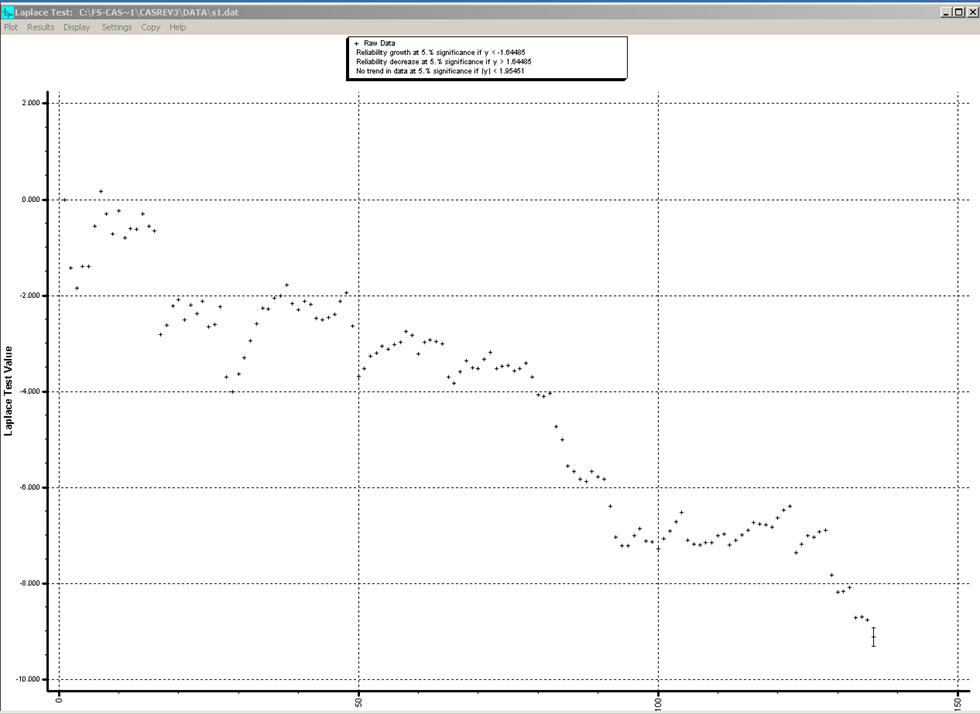
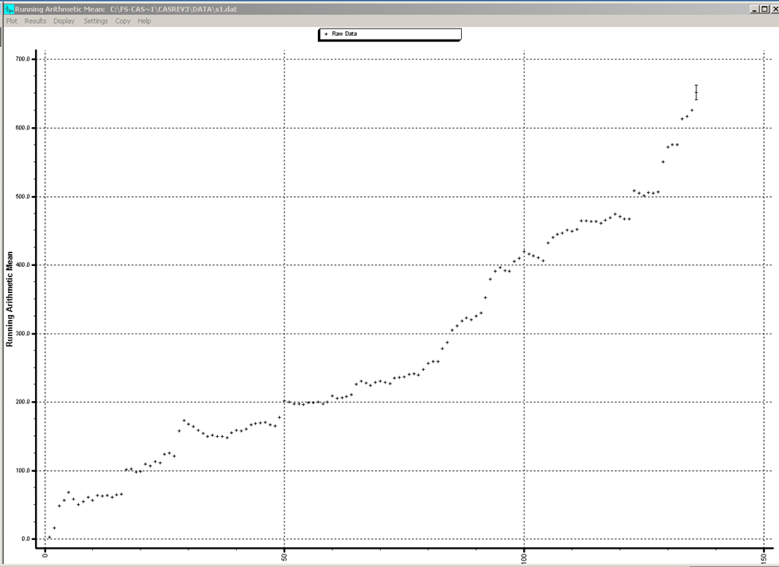
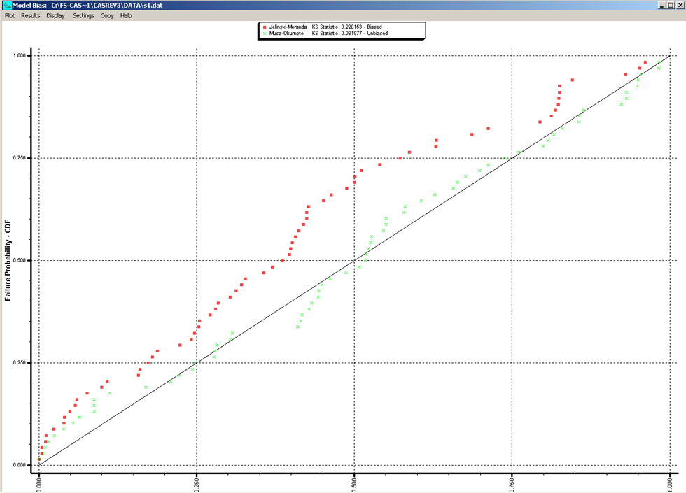
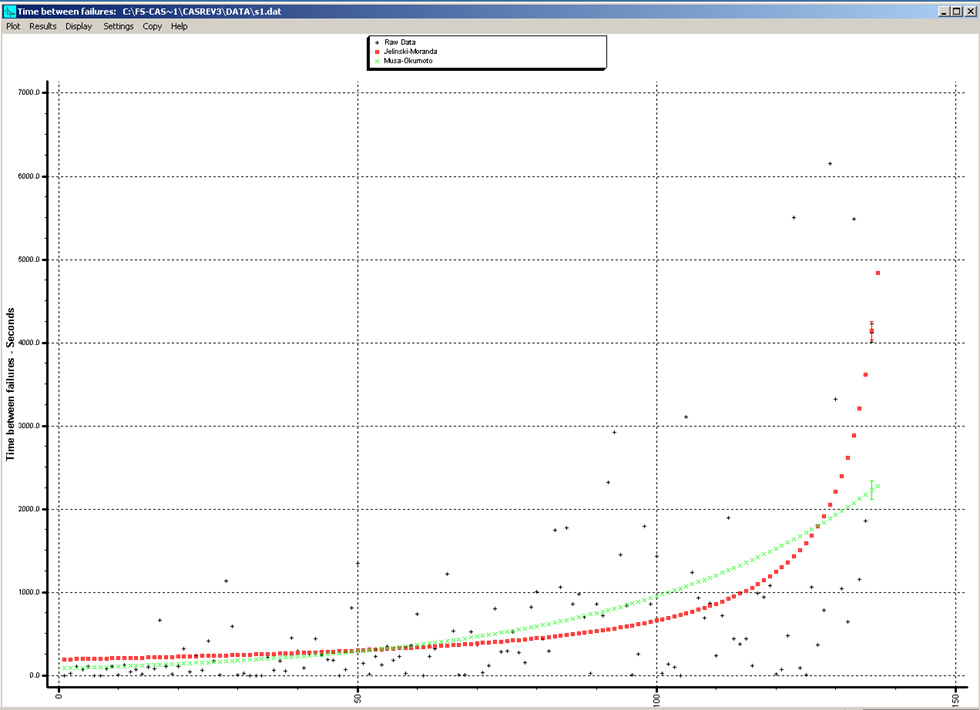
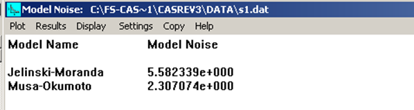
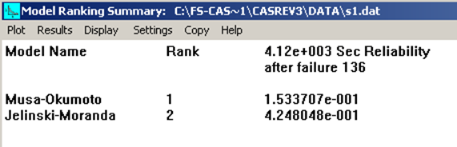

# Tools

<!--- we just need to take some screenshots for a few of these tools--->

## CASRE

Laplace graph.

Running average.

The u-plot.

Comparison of JM and MO models.

Model noise.

Model summary after setting GOD to 3 and model bias to 1.

